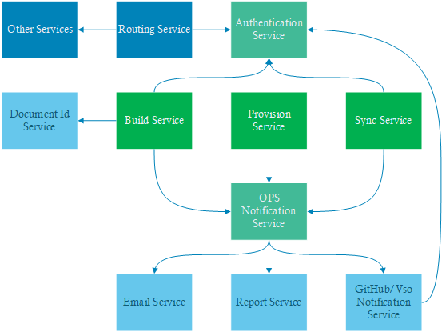

# OPS Build Service vNext

## Pain points
1. No easy way for developing and debugging.
   - Technical stacks. Namely msbuild, powershell, C# and etc.
   - No local version.
   - Shared base framework (like aggregate, report, email) for different functionalities make code change hard.
2. Hard to maintain.
   - Worker role itself limitation of deploying and scaling speed.
   - 3rd service/tools upgrade manitaining effort on worker role like security pack.
3. Too many build services unrelated functionalities.
   - Notification function in build, like email, PR comments, report generation and etc.
   - Authentication in build. Build also holds OAuth functionality of OPS, which can be totally separate from build service itself.
   - Sync/Provision function.
4. Coupled with build tool.
   - Build service cares too many implementations of build tool. Especially for preparing environment part for build tool in PowerShell or workflow pipeline.
   - Build service 
5. Service plugin model?
   - **Powerful** but out of control.
   - **Easy for custmizing**.
   - Make build result unexpected.

## What we want
1. An easy local debugging and developing environment for service.
2. A service with quick deploying and scaling.
3. A clean and tool independent build service.
4. Keep enterprise level build service.
   - Able to control capacity with some mechanism like priority.
   - Global control to some features like timeout, service account usage, cache control.
5. Micro services

## Compare of platform service and micro services
Platform service means creating a service provide basic functionality for different service plugins.
Micro services means separate different independent function to different services.

The following table is a comparision between platform service and micro service

| Number | Point | Platform | Micro Service |
| --- | --- |:-----|:-----|
| 1 | Deploy | **Advantages**<ul><li>Unified deployment</li></ul> **Disadvantages**<ul><li>Unable to remove dependency between functionalities.  *Solution*: N/A</li></ul> | **Advantages**<ul><li>Free to deploy any micro service</li><li>No dependency</li></ul> **Disadvantages**<ul><li>No shared deployment.  *Solution*: share deploy script</li></ul> |
| 2 | Scale | **Disadvantages**<ul><li>No easy scability for different functionality.  *Solution*: platform provides mechinism to make scale independently.</li></ul> | **Advantages**<ul><li>Easy to scale different service base on capacity requirement</li><li>Economical</li></ul> |
| 3 | Develop and Debug | **Advantages**<ul><li>Shared service functionality</li></ul> **Disadvantages**<ul><li>Platform development needs to care more about campatible to different plugins. *Solution*: versioning</li><li>Functionality plugins need to understand how to use platform provided function. *Solution*: versioning</li><li>Hard to trouble shooting and debug because of dependency.</li></ul> | **Advantages**<ul><li>No directly dependency to infrastructure service.</li><li>Easy to do trouble shooting</li></ul> **Disadvantages**<ul><li>No shared infrasturecture service provided. *Solution*: Provide shared code libraray for different services.</li></ul> |

## System architecture compare

### Platform service

### Micro services

