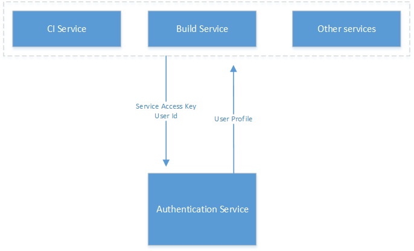

# OPS Authentication Service Design Spec

## Issue want to resolve
As we know that if partners want to use OPS system, they need to authorize either GitHub OAuth Application or VSO OAuth Application created by OPS build service.  
With that, OPS build service can direclty visit partners repository to verify a user's permission to the repository.
And can also do sync, build, rename or more operation on behalf of parnter because OPS build has user's OAuth token.  
However, recently some other services also want those abilities. Obviously, to create different OAuth Application for different services and let partners to OAuth them is not reasonable.
Here comes the idea of Authentication Serivce of OPS. It focus to resolve the following issues
1. Make permission check in a concentrated place.
2. Provide a service for OPS different components to get user's profile include OAuth token if required.
3. Clean the wrapper layer code in current OPS build code.

## Overall design
Overall design of Authentication Service (shorten as AS) is like following shows:  
  

### AS feature I - provide user profile
1. Other services call AS with service access key (provided by AS and share to trusted service) and user id
2. AS service provides the user profile to the calling service

### AS feature II - provide user permission check
1. Other service call AS with service access key and user id
2. AS service provides user's permission to the calling service

## 
